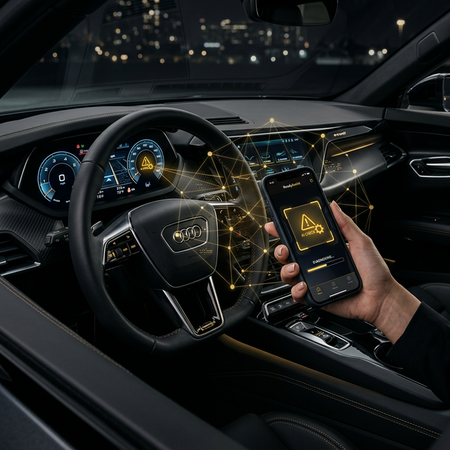

# Symbol Manager AI - ReadyAssist



A high-fidelity, two-stage AI diagnostic system designed to decode car dashboard symbols with professional accuracy. Built for **ReadyAssist**, this platform democratizes expert vehicle diagnostics using state-of-the-art computer vision.

## 🚀 Key Features

- **Model Manager Architecture**: A robust two-stage pipeline:
  - **Stage 1 (Detector)**: YOLOv8 specialized for high-recall symbol localization.
  - **Stage 2 (Classifier)**: ResNet-50 for fine-grained classification across 87+ automotive classes.
- **Intelligent UI**: Premium ReadyAssist branding (Gold & Black) with smooth animations and interactive metrics.
- **Web Intelligence**: Side-by-side dashboard providing global metadata and expert recommendations for every detected symbol.
- **Neural Processing Simulation**: Real-time feedback during AI analysis, including pixel matrix scanning and weight optimization.

## 🛠 Tech Stack

- **Backend**: FastAPI (Python 3.10+)
- **AI/ML**: PyTorch, Ultralytics (YOLOv8), Torchvision (ResNet-50)
- **Frontend**: Vanilla HTML5, CSS3, JavaScript (ES6+)
- **Icons**: Lucide Icons

## 📋 Installation

1. **Clone the repository**:
   ```bash
   git clone git@github.com:VedprakashRAD/Dashboard.git
   cd "Dashboard Symbols"
   ```

2. **Set up virtual environment**:
   ```bash
   python3 -m venv venv
   source venv/bin/activate
   pip install -r requirements.txt
   ```

3. **Run the server**:
   ```bash
   python3 main.py
   ```

4. **Access the Dashboard**:
   Open [http://127.0.0.1:9000](http://127.0.0.1:9000) in your browser.

## 🧠 Model Manager Info

The system uses a `ModelManager` class to orchestrate the detection and classification.
- **Confidence Tiers**: Technical metadata pills display both Detector and Classifier confidence.
- **Data Coverage**: Trained on an augmented dataset of 17,800+ high-fidelity images.

## 🗺 Roadmap

- [x] Two-Stage Model Manager Implementation
- [x] Premium ReadyAssist UI Redesign
- [x] GitHub Deployment (Full Data & Models)
- [ ] **Phase 7: Odometer Diagnostic Integration** (In Progress)
  - [ ] Odometer Detection (YOLOv8-tiny)
  - [ ] Mileage Extraction (OCR Pipeline)

---
&copy; 2026 ReadyAssist Automotive Services Pvt. Ltd. | AI Model Manager V2.0
